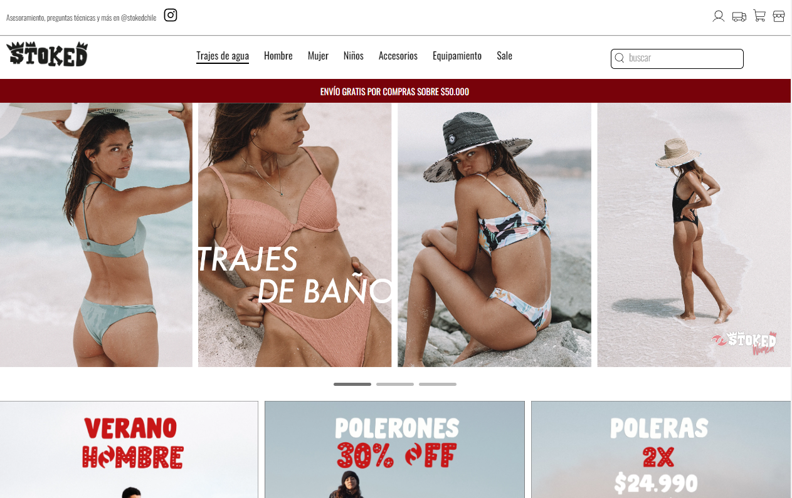
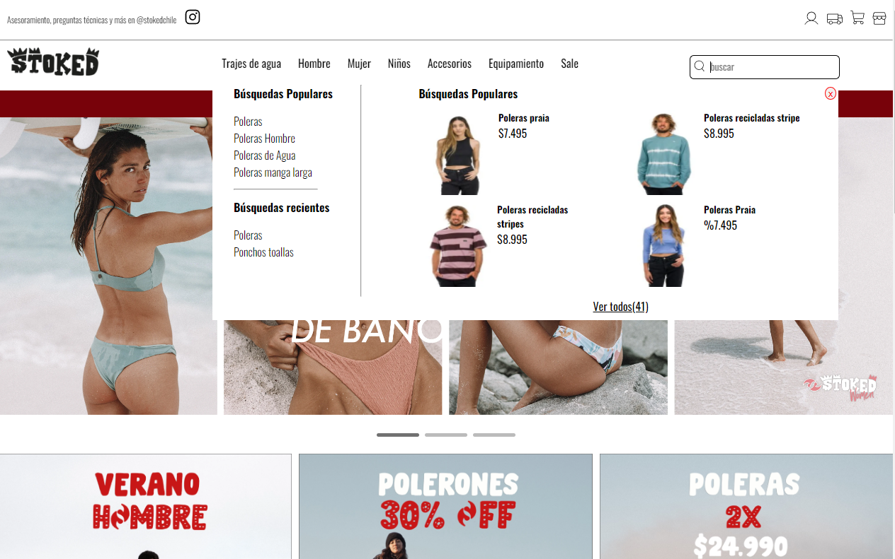

# 🏄‍♂️ Stoked - Komax Frontend Developer
## 💡 Descripción

Challenge para el puesto de Frontend Developer en Komax.cl. El objetivo era crear una landing home basada en el [mockup figma compartido] (https://www.figma.com/file/cMcFibqhJpBB4KZTfGXoQx/Stoked-Practice-Home?node-id=0%3A1&t=zBgiTDbIb34IcSXn-1). 

## 💅 Diseño:  
El diseño recibido comprende lo siguiente:
- Header
- Content
- Footer

## Sobre el desarrollo:   
La landing page fue realizada de manera progresiva, siguiendo un patron "mobile first" y utilizando las siguientes tecnologías:
- HTMl5
- CSS
- Javascript Vanilla
- Owl Carousel 2
- Swiper Slider
- Git

### Decisiones en el camino:
* Se crearon ramas dependiendo de la tarea que estaba realizando. 
* En el carousel de productos, en el diseño compartido no coincidian las imagenes con sus productos. Por ejm, la imagen de una mochila tenia como titulo "SHORT GOOFY MUJER RECICLADO". A estos detalles los reemplace por productos traidos de la web de Stoked.
* En la sección de categorias se mostraban solo tres imagenes,repeditas dos veces cada una y los nombres de las categorias no acompañaban a estas imagenes. Resolvi crear tres imagenes nuevas (traidas desde la web de Stoked) con el mismo formato que la que estaban asignadas y también incorporé los nombres de categorias de esas tres imagenes que se encontraban previamente y no coincidian. 
* Se validó el formulario de subscripción.

🚀 Deploy:https://stoked-komax-franciscomolina.netlify.app/

## 🧷  Screenshots del resultado:
Se pueden ver más desde la carpeta "screenshots" de este proyecto.

 

## 🧷  Puntos de mejora:
- Incorporar el menu desplegable de la vista mobile.
- Contener con un ancho maximo a las vistas para considerar la experiencia del usuario en pantallas muy anchas.
- Renderizar los componentes de las secciones desde archivos js (simulando un React.js) para hacer más legible el código del index.html.
- Revisar la nomenclatura del CSS.

## Autor:
Francisco D. Molina  
 

